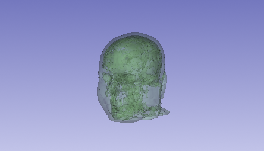

# 3D Cranial Reconstruction Project
## Technical Workflow & Data Visualization

### Project Overview
This project demonstrates the processing of MRI DICOM data to create a high-fidelity 3D anatomical model.

### Key Skills Demonstrated:
* **Data Processing:** Imported MRI DICOM datasets and performed anatomical segmentations.
* **3D Visualization:** Utilized the Reformat and Volume Rendering modules to create semi-transparent models.
* **Scene Management:** Managed complex Subject Hierarchies and node visibilities to produce clean renders.

